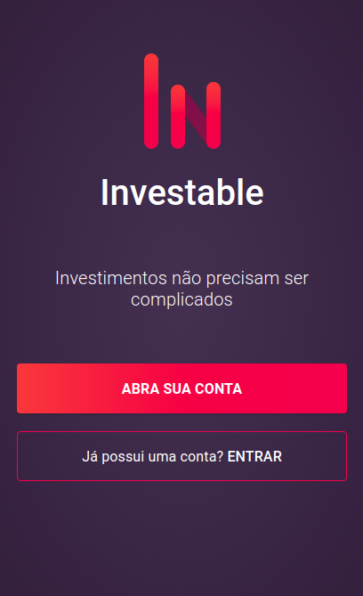

<p align="center">
<a href="https://investable.vercel.app/" target="_blank">

</a>
</p>

# Investable

## Getting Started

Para visualização do projeto você deve ter instalado em sua máquina uma versão LTS ou superior do Node.js.

### Pré Requisitos

Segue os pré requisitos para rodar o projeto em localhost

- [NODE] (https://nodejs.org/en/download/)
- [YARN] (https://yarnpkg.com/pt-BR/docs/install)

### Instalação

Passo para rodar o projeto em localhost

Clonar o projeto

```
https://github.com/silviocamposs/investable
```

### Dependencias

```
yarn install
```

Com todos as dependências instaladas digite o comando adequado

```
yarn start
```

Navegador será aberto no enderço http://localhost:3000.

## Api

Api Rest está "mockada" no jsonbox.io

```
https://jsonbox.io/box_bd97f2f7fa3dcc980229
```

### Coleções

```json
    USUARIO

    {
        "_id": "6016c4ad330141001545f71e",
        "name": "Lucas",
        "email": "lucas@email.com.br",
        "cpf": "357.424.128-02",
        "rg": "12.569.054-5",
        "age": "21",
        "taste": "Eu gosto de investimentos!",
        "like_more": "Rentabilidade",
        "_createdOn": "2021-01-31T14:54:37.512Z"
    }
```

```json
    INVESTIMENTO

    {
        "_id": "6016b3f6330141001545f5d2",
        "type": "CDB",
        "title": "BANCO NEON - JUL/2023",
        "rates": 9.3,
        "_createdOn": "2021-01-31T13:43:18.065Z"
    }

```

### Rotas

```
    CRIAR UM USUARIO

    POST - /user
    data - {
        "name": "Lucas",
        "email": "lucas@email.com.br",
        "age": "21",
        "taste": "Eu gosto de investimentos!",
        "like_more": "Rentabilidade",
    }
```

```
    FILTRAR UM USUARIO / LOGIN

    GET - /user
    params - {
        "q": "name:Lucas",
    }
```

```
    BUSCAR TODOS INVESTIMENTOS

    GET - /investiments
```

```
    FILTRAR INVESTIMENTOS POR TIPO

    GET - /investiments
    params - {
        "q": "type:cdb",
    }
```
